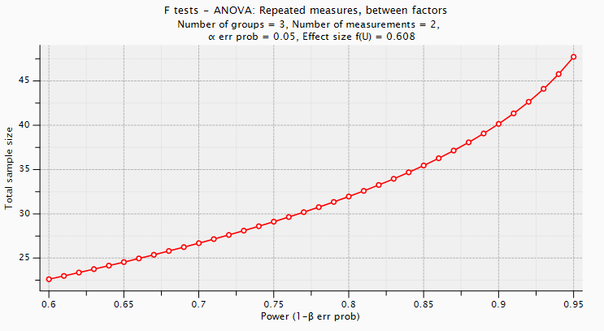
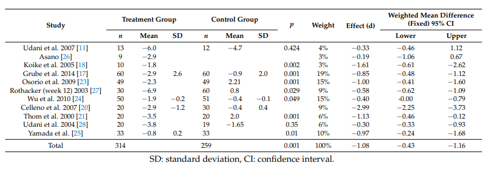
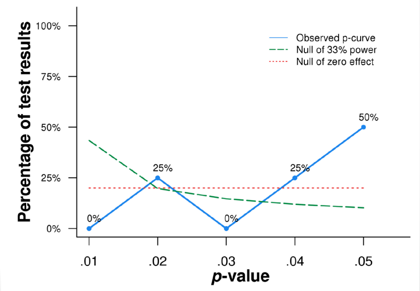
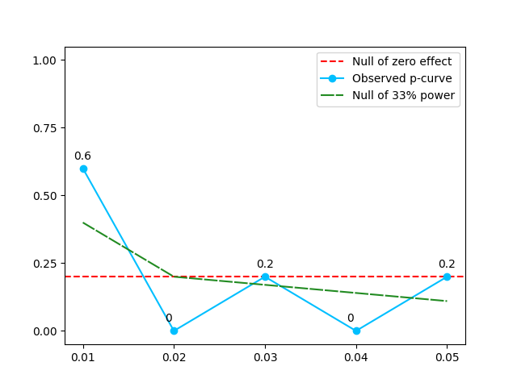

```{r setup, include=FALSE}
knitr::opts_chunk$set(echo = TRUE)
```

In this assignment, we will think about how to interpret p-values and how those are affected by statistical power. Parts of this assignment were inspired by Daniel Lakens' Coursera course "Improving your statistical inferences".

First we examine the shape of distributions of p-values between situations where there is no effect, a weak effect, or where there is a strong effect. In addition, we will look at what happens if we do not correct for multiple comparisons.

# Understanding p-values through simulation

Which p-values you can expect is determined by the statistical power of the study (i.e., the probability that you will observe a significant effect, if there is a true effect). The statistical power ranges from 0 (no power) to 1 (will detect every effect that is present).

Let’s get started by performing some simulations. In the script below, you will simulate the IQ scores of groups of people participating in a fictitious experiment. We know the standard deviation ($SD$) of IQ scores is 15. For now, we will set the mean IQ score ($M$) in the simulated group to 106, which we will compare to the average IQ score of all people (which is known to be 100 – that’s how IQ tests are normalized). We are testing whether the people in our simulated sample have a higher IQ than average (and we know the correct answer is ‘yes’, because we made it so in the simulation). Since the number of simulations ($nSims$) is 100,000, it will take a while to run this simulation. As output, it creates a plot of all observed p-values across the 100,000 simulated experiments of drawing groups of people from the population and measuring their IQ.

```{r,eval=FALSE}
#Load pwr package to easily calculate the statistical power
if(!require(pwr)){install.packages('pwr')}
library(pwr)
#Disable scientific notation (1.05e10)
options(scipen=999)
#Set number of simulations
nSims <- 100000 #number of simulated experiments

M<-106 #Mean IQ score in the sample (will be compared with 100 in a one-sample t-test)
n<-26 #set sample size
SD<-15 #SD of the simulated data
#With a mean difference of 6, and SD of 15, and a sample size of 26, the test has 50% power)
  
p <-numeric(nSims) #set up empty variable to store all simulated p-values
bars<-20
#Run simulation
for(i in 1:nSims){ #for each simulated experiment
  x<-rnorm(n = n, mean = M, sd = SD) #Simulate data with specified mean,
  #standard deviation, and sample size
  z<-t.test(x, mu=100) #perform the t-test against mu (set to value you want to test against)
  p[i]<-z$p.value #get the p-value and store it
}

#Check power by summing significant p-values and dividing by number of simulations
(sum(p < 0.05)/nSims) #power
#Calculate power formally by power analysis
power<-pwr.t.test(d=(M-100)/SD, n=n,sig.level=0.05,type="one.sample",alternative="two.sided")$power

#Plot figure
#png(file="P-valueDist.png",width=4000,height=3000, , units = "px", res = 500)
op <- par(mar = c(5,7,4,4)) #change white-space around graph
hist(p, breaks=bars, xlab="P-values", ylab="number of p-values\n", axes=FALSE,
     main=paste("P-value Distribution with",round(power*100, digits=1),"% Power"),
     col="grey", xlim=c(0,1),  ylim=c(0, 10000))
axis(side=1, at=seq(0,1, 0.1), labels=seq(0,1,0.1))
axis(side=2, at=seq(0,nSims, nSims/10), labels=seq(0,nSims, nSims/10), las=2)
# draw a line of the p-value distribution when the null hypothesis is true
abline(h=nSims/bars, col = "red", lty=3)
#dev.off()
```

On the x-axis we see p-values from 0 to 1 in 20 bars, and on the y-axis we see how frequently these p-values were observed across all the simulated experiments. There is a horizontal red dotted line that indicates an alpha (type I error) of 5%--basically the level where the graph would be if all p-values were equally divided across the bins. In the title of the graph, the statistical power that is achieved in the simulated studies is given (assuming an alpha of 0.05): In this case the studies have 50% power.

(a) What happens to the statistical power and distribution of p-values when you increase the sample size from 26 people to 51 people? Show the data and explain your answer.

```{r,echo=FALSE, message=FALSE, warning=FALSE, results='hide'}
#Load pwr package to easily calculate the statistical power
if(!require(pwr)){install.packages('pwr')}
library(pwr)
#Disable scientific notation (1.05e10)
options(scipen=999)
#Set number of simulations
nSims <- 100000 #number of simulated experiments

M<-106 #Mean IQ score in the sample (will be compared with 100 in a one-sample t-test)
n<-51 #set sample size
SD<-15 #SD of the simulated data
#With a mean difference of 6, and SD of 15, and a sample size of 26, the test has 50% power)
  
p <-numeric(nSims) #set up empty variable to store all simulated p-values
bars<-20
#Run simulation
for(i in 1:nSims){ #for each simulated experiment
  x<-rnorm(n = n, mean = M, sd = SD) #Simulate data with specified mean,
  #standard deviation, and sample size
  z<-t.test(x, mu=100) #perform the t-test against mu (set to value you want to test against)
  p[i]<-z$p.value #get the p-value and store it
}

#Check power by summing significant p-values and dividing by number of simulations
(sum(p < 0.05)/nSims) #power
#Calculate power formally by power analysis
power<-pwr.t.test(d=(M-100)/SD, n=n,sig.level=0.05,type="one.sample",alternative="two.sided")$power

#Plot figure
#png(file="P-valueDist.png",width=4000,height=3000, , units = "px", res = 500)
op <- par(mar = c(5,7,4,4)) #change white-space around graph
hist(p, breaks=bars, xlab="P-values", ylab="number of p-values\n", axes=FALSE,
     main=paste("P-value Distribution with",round(power*100, digits=1),"% Power"),
     col="grey", xlim=c(0,1),  ylim=c(0, 10000))
axis(side=1, at=seq(0,1, 0.1), labels=seq(0,1,0.1))
axis(side=2, at=seq(0,nSims, nSims/10), labels=seq(0,nSims, nSims/10), las=2)
# draw a line of the p-value distribution when the null hypothesis is true
abline(h=nSims/bars, col = "red", lty=3)
#dev.off()
```

As can be seen in the graph above, the statistical power increases when you increase the sample size. Similarly, the p-value distribution skews more towards the lower p-values as the chances for low p-values plummet when statistical power increases, with most of the simulations having a p-value below 0.05. This makes sense considering increasing the statistical power mostly increases our chance to find true positives (and decreases the chance of finding false negatives) and in this example we know for a fact we are working with true positives. 

(b) What happens when you set the difference in IQ between sample and population to zero (M <- 100)? In other words: what does a p-value distribution look like when there is no difference/ the null hypothesis is true? Explain your answer and illustrate it with a plot.

```{r,echo=FALSE, message=FALSE, warning=FALSE, results='hide'}
#Load pwr package to easily calculate the statistical power
if(!require(pwr)){install.packages('pwr')}
library(pwr)
#Disable scientific notation (1.05e10)
options(scipen=999)
#Set number of simulations
nSims <- 100000 #number of simulated experiments

M<-100 #Mean IQ score in the sample (will be compared with 100 in a one-sample t-test)
n<-51 #set sample size
SD<-15 #SD of the simulated data
#With a mean difference of 6, and SD of 15, and a sample size of 26, the test has 50% power)
  
p <-numeric(nSims) #set up empty variable to store all simulated p-values
bars<-20
#Run simulation
for(i in 1:nSims){ #for each simulated experiment
  x<-rnorm(n = n, mean = M, sd = SD) #Simulate data with specified mean,
  #standard deviation, and sample size
  z<-t.test(x, mu=100) #perform the t-test against mu (set to value you want to test against)
  p[i]<-z$p.value #get the p-value and store it
}

#Check power by summing significant p-values and dividing by number of simulations
(sum(p < 0.05)/nSims) #power
#Calculate power formally by power analysis
power<-pwr.t.test(d=(M-100)/SD, n=n,sig.level=0.05,type="one.sample",alternative="two.sided")$power

#Plot figure
#png(file="P-valueDist.png",width=4000,height=3000, , units = "px", res = 500)
op <- par(mar = c(5,7,4,4)) #change white-space around graph
hist(p, breaks=bars, xlab="P-values", ylab="number of p-values\n", axes=FALSE,
     main=paste("P-value Distribution with",round(power*100, digits=1),"% Power"),
     col="grey", xlim=c(0,1),  ylim=c(0, 10000))
axis(side=1, at=seq(0,1, 0.1), labels=seq(0,1,0.1))
axis(side=2, at=seq(0,nSims, nSims/10), labels=seq(0,nSims, nSims/10), las=2)
# draw a line of the p-value distribution when the null hypothesis is true
abline(h=nSims/bars, col = "red", lty=3)
#dev.off()
```

Putting the average IQ to 0 (and keeping the sample size at 51), we get an almost perfectly even distribution of p values which follow the red line. Unsurprisingly, this looks like a flat p-curve because there is no effect to be observed and the variations in results are at random. 

(c) Go back to the situation in which the mean M is 106. Now we will look at what p-values just below the p-value threshold of p=0.05 mean. What happens to your statistical power when you change the p-value threshold (0.05 in the code above) from 0.05 to 0.01? Explain your answer.

```{r,echo=FALSE, message=FALSE, warning=FALSE, results='hide'}
#Load pwr package to easily calculate the statistical power
if(!require(pwr)){install.packages('pwr')}
library(pwr)
#Disable scientific notation (1.05e10)
options(scipen=999)
#Set number of simulations
nSims <- 100000 #number of simulated experiments

M<-106 #Mean IQ score in the sample (will be compared with 100 in a one-sample t-test)
n<-51 #set sample size
SD<-15 #SD of the simulated data
#With a mean difference of 6, and SD of 15, and a sample size of 26, the test has 50% power)
  
p <-numeric(nSims) #set up empty variable to store all simulated p-values
bars<-20
#Run simulation
for(i in 1:nSims){ #for each simulated experiment
  x<-rnorm(n = n, mean = M, sd = SD) #Simulate data with specified mean,
  #standard deviation, and sample size
  z<-t.test(x, mu=100) #perform the t-test against mu (set to value you want to test against)
  p[i]<-z$p.value #get the p-value and store it
}

#Check power by summing significant p-values and dividing by number of simulations
(sum(p < 0.01)/nSims) #power
#Calculate power formally by power analysis
power<-pwr.t.test(d=(M-100)/SD, n=n,sig.level=0.01,type="one.sample",alternative="two.sided")$power

#Plot figure
#png(file="P-valueDist.png",width=4000,height=3000, , units = "px", res = 500)
op <- par(mar = c(5,7,4,4)) #change white-space around graph
hist(p, breaks=bars, xlab="P-values", ylab="number of p-values\n", axes=FALSE,
     main=paste("P-value Distribution with",round(power*100, digits=1),"% Power"),
     col="grey", xlim=c(0,1),  ylim=c(0, 10000))
axis(side=1, at=seq(0,1, 0.1), labels=seq(0,1,0.1))
axis(side=2, at=seq(0,nSims, nSims/10), labels=seq(0,nSims, nSims/10), las=2)
# draw a line of the p-value distribution when the null hypothesis is true
abline(h=nSims/bars, col = "red", lty=3)
#dev.off()
```

Decreasing the p-value threshold to 0.01 will not affect the statistical power, instead, it will affect the type 1 error rate, decreasing the amount of false positives and increasing the amount of true negatives. In other words, the p value threshold being lower does not give more credibility to our findings, instead, it just decreases the probabilities of finding significant results where there were no actual significance present while rejecting other potential significant findings. In our example, this would mean that even though the tests between 0.01 and 0.05 could actually have had an effect (which we know for a fact they do), they would be rejected; nevertheless, since we have more than enough examples that fall below the threshold, the true effect would not be missed when doing a p-value analysis.

# How p-values change as you collect more data

The Type 1 error rate in behavioral research (the probability of saying there is an effect, when there is no effect, i.e., the false alarm rate/false positive rate) is often set at 0.05. In recent years, researchers have become increasingly aware of research practices that inflate the Type 1 error rate. One research practice that could inflate the type 1 error is called optional stopping. In optional stopping, a researcher repeatedly analyzes the data, continues the data collection when the test result is not statistically significant, but stops when a significant effect is observed. 

For example, in a memory experiment you would rerun your statistical test after every new participant is tested. This is a reasonable way of working when data are very difficult to collect, or very burdensome (e.g., testing patients with a rare disease). But of course this also increases the number of tests you run, and therefore exacerbates the multiple comparisons problem. And even in most Bachelor projects you would first do one or more pilot studies, and then when one of those show a significant effect collect more data. So what consequences has this practice for your type I error rate?

The script below simulates running an experiment multiple times and after the first 10 participants checking every  participant (i.e., data point) what the p-value is (as a researcher might do who wants to see when s/he should stop collecting data). The simulation looks at a situation where there is no true effect (indicated by the parameter D<-0), and when these tests start to lead you to conclude that there is in fact an effect (when there is none in reality).

```{r,eval=FALSE}
n<-200 #total number of datapoints (per condition) you are willing to collect after the initial 10
D<-0.8 #True effect size (Keep SD below to 1, otherwise, this is just mean difference, not d)
SD<-1 #Set True standard deviation.
p<-numeric(n) #store p-values
x<-numeric(n) #store x-values
y<-numeric(n) #store y-values
n<-n+10 #script calculates p-values after 10 people in each condition,
#so add 10 to number of datapoints
for(i in 10:n){ #for each simulated participants after the first 10
x[i]<-rnorm(n = 1, mean = 0, sd = SD)
y[i]<-rnorm(n = 1, mean = D, sd = SD)
z<-t.test(x[1:i],y[1:i], var.equal=TRUE) #perform the t-test
p[i]<-z$p.value
}
p<-p[10:n] #Remove first 10 empty p-values
#Create the plot
#png(file="p-value_over_time.png",width=4000,height=2000, , units = "px", res = 500)
plot(0, col="red", lty=1, lwd=3, ylim=c(0,1), xlim=c(10,n), type="l", xlab='sample size',
ylab='p-value', cex.lab=1, cex.axis=1)
lines(p, lwd=2)
abline(h=0.05, col="darkgrey", lty=2, lwd=2) #draw ine at p = 0.05
#dev.off()
min(p) #Return lowest p-value from all looks
cat("The lowest p-value was observed at sample size ",which.min(p)+10)
#Return the sample size at which the p-value was smallest
cat("The p-value dropped below 0.05 for the first time at sample size ",which(p<0.05)[1]+10)
#Return the sample size at which the p-value dropped below 0.05 for the first
```

(a) What do you see in the graph? Explain what this means.

The graph is a visualization of what happens after we calculate a different p-value every time we introduce a new sample size, with the dashed gray line indicating the 0.05 p-value threshold. The phenomenon the plot describe is, with every introduction of a new participant, the p-value slowly shifts towards another value, which could accidentally be below the 0.05 threshold.

This is particularly bad for a research point of view because it allows the researcher to manipulate the data until it gives a desirable result, for example, if the researcher decides to stop when the p-values drops below the threshold and hides the other calculate values, making it seem that an effect has likely taken place when in reality it did not.

(b) Then run the script 20 times and count how often the p-value ends up below 0.05. What happens to this proportion when you continue to collect data until you have 2000 participants? What does that mean?

The p-value ended up below 0.05 seven times in the twenty runs, and when the number of participants increased to 2000, the p-value dipped below 0.05 twelve times in twenty runs. This means that if a research keeps on adding new participant and recalculating the p-value, it will likely result in more points that fell below the cutout value eventually, raising the chances of false claims as explained on the previous item.

(c) What happens to the p-values trajectory when you increase the effect size to D=0.3 (a small effect) and then to D=0.8 (a large effect)? What does that mean?

With a D value of 0.3, the graph tends to fall below 0.05 after roughly a few dozen of interactions, while if we increase the D value to 0.8, this convergence tends to be quicker, with the line dropping fast; for both cases, the line tends to stay below the threshold, but with the higher D value seemingly being more stable. This means that if an actual effect has taken place, the number of tests that will fall below the threshold will be larger and will not be due to just random chance, with larger effect sizes affecting the number of times it'll generate a possible significant finding.

(d) What advice about avoiding false positives and false negatives can you give based on the findings from these simulations? Make sure you refer in your answer to the results you obtained in the simulations.

To avoid false positives, it would generally be advisable to not rerun the tests each time a new participant is added as well as diminishing the p-value threshold, since the values that fell below 0.05 were only due to random chance, the less time we repeat the test the less likely it will be for a test to be a false positive, and if we decrease the threshold, then it will be less likely that the p-value of a given test will randomly fall into it. 

Furthermore, to avoid false negatives, increasing the statistical power by increasing the number and quality of data can be used, this is the case because a larger sample size will more likely simulate the situation properly and come closer to the true mean and standard deviation of the model, diminishing the odds of random noise greatly affecting the results and masking an effect were there would be one.


# Doing a power analysis

To decide how much data to collect beforehand for a preregistration you can do a power analysis. A power analysis allows you to compute the number of data points you need if you want a specific power level, a specific type I error rate (p-value threshold), and you have a particular effect size (e.g., from previous studies). A very easy way to do a power analysis is by using the free software G*power. You can download that software here: http://www.gpower.hhu.de 

Let's first do a power analysis for a t-test. To do so, we need an estimate of the effect size from previous studies. Assume that we want to replicate the so-called "louder=closer" effect, which was found in a study by Zhang, Lakens & Ijsselsteijn (2015; https://www.sciencedirect.com/science/article/pii/S0001691815000360?casa_token=aWpvDKOYsxMAAAAA:k2iZzR2Q89jM_eXcH9zDJ8I_W2DX7bQVima8wW0NGnS9tujLXcAhfW8BAZdhdG3Y4l43jCXawQ), who showed that when people heard a communication partner's voice more loudly, they assumed the person was closer. They used a between-subject design with 20 participants in the softer voice condition and 22 participants in the louder voice condition. In their article they wrote "participants judged the caller's location to be nearer if they heard a louder compared to a softer voice ($M_{softer}$=9.93, $SD_{softer}$=3.61, $M_{louder}$=7.34, $SD_{louder}$=3.77; $t(40)=2.27$; $p=0.029$; 95% CI [0.07,1.32])."

(a) For power analysis you need an effect size, which in a between-subject design requires a pooled standard deviation. Since we do not have a pooled standard deviation, we need to use the spreadsheet (from_R2D2.xlsx) from https://osf.io/wgsi3/ to compute the effect size $d_s$ from the Zhang et al study on the basis of the reported data. Compute the effect size using the spreadsheet, filling in the relevant data in row 4, then report what effect size $d_s$ you found and describe what you did to arrive at this number. Also interpret the magnitude of this effect size.

We find the effect of the t-test by looking at the p-value and the sample sizes (n1 & n2) of the two groups of participants from the paper. We make sure that the dropdown on the left is set to between subject design. We find that the effect size $d_{s}$=0.70. In social sciences a value of 0.5 is considered medium and 0.8 is considered large. So the effect in this paper is close to large.

(b) Once we have an effect size, you can use G*power to compute required numbers of participants (if you were not able to complete question (a) use a standard medium-to-large effect size of 0.6). Assuming you want to do the study with 80% power with a p-value threshold of 0.05 and a two-tailed t-test, how many participants do you need to test? Make sure you also describe what you did to arrive at this number.

We use G*Power to find the required sample size per group. We select the family of tests as t-tests. And measure the difference between two independent means. We select two tails. We fill in the effect size found in (a) which is 0.70. We set alpha to 0.05. The power to 0.80 and the sample size ratio to 1, as we assume that there are enough people available. If we click "Calculate", we find that the total required sample size is 68 participants. 34 for each group.

(c) It has recently been suggested (https://www.nature.com/articles/s41562-017-0189%20z) we should change our p-value threshold to 0.005. How many participants would you need to test in that case? Describe how you get to that answer. So, is it feasible to go for the lower p-value threshold?

We change the alpha on the left side to 0.05. We click "Calculate" again to see the new results. In this case we need 114 participants, which is way more than with a higher alpha. In this case it is feasible to find 114 participants to perform the research. However if you want to perform research with a higher power, the required participants also can become much higher.

A test used more frequently than a t-test is a repeated measures anova (in G*power, this is in the family of F-tests). Assume you want to replicate this study by Lakens (2013; https://www.researchgate.net/profile/Daniel_Lakens2/publication/260658399_Using_a_Smartphone_to_Measure_Heart_Rate_Changes_during_Relived_Happiness_and_Anger/links/550e87880cf212874168db0d/Using-a-Smartphone-to-Measure-Heart-Rate-Changes-during-Relived-Happiness-and-Anger.pdf), in which he looked at heart rate while people were thinking about happy and things that made them angry, and compared that to baseline. They wrote the following: "There was a clear main effect of emotion, F(2,132)=23.89, $p<0.001$, $\eta_p^2$=.27. Heart rate was higher while recalling the anger (M=72.06, SD=12.11) and happiness (M=69.00, SD=12.17) emotions compared to the baseline measurement (M=64.59, SD=10.33), t(67)=7.11, $p<0.001$, $\eta_p^2$=.43 and t(67)=5.34, $p<0.001$, $\eta_p^2$=.30, respectively."

*Note: To get Gpower to compute power correctly for this within-subject design, you need to tell it that the effect size estimate is "as in SPSS", which is a tickbox under the "Options" menu at the bottom of the page. You insert the effect size into the calculation using the "determine" button, which opens a window where you can insert the partial $\eta^2$.*

(d) Report how many participants you would need to run to replicate this study with 80% power. Then use the "X-Y plot for a range of values" button to explain how this number depends on the desired power level. Make sure you describe how you got to this answer/graph.

We use G*Power to find the required total sample size. First we select the f-family of tests, then we select the repeated measurements ANOVA to test between factors. Now we can fill in the alpha as 0.05, the power as 0.80. The number of groups is 3 which corresponds to the 3 conditions: angry, happy and baseline. The amount of measurements is 2, because the participants perform happy and angry. We use the determine window to calculate the effect size from variance. We click the "direct" button and fill in the partial eta squared which is 0.27. If we calculate this we get a f(U) of 0.608. With this we can calculate the sample size which is 33. 



Now we click the X-Y plot button to see how the sample size increases with the power. We can see that the sample size gradually increases if we want a higher power. This is because we want to prevent type II errors, for this we need more samples. 

There exists a more precise and less biased measurement of effect size for ANOVA, which is called $\omega_p^2$. Use https://osf.io/sjgv4/ (Calculate Partial Eta Omega Epsilon Squared.xlsx) to compute $\omega_p^2$. Then fill this in the power analysis in place of the partial $\eta^2$.

(e) How do the results change? Comment on what this means for power analysis in general. In other words: comment on how much trust you can place in power analyses.

When we plug in the F value and the numbers in the brackets, we get a completely different result for the omega: 0.25. This is 3 times smaller than the previous value. If we use this value to calculate the sample size, we get 162 participants. Which is a lot more than before. This means the power analysis is very dependent on the values you put in it. A a priori power analysis gives an indication of the sample size, but you can't place all your trust in it.


# Doing a p-curve analysis

In this question, you will do your own p-curve analysis of a research field of your choice. Follow these steps:

1. Choose a paper with a meta-analysis (one easy way to find such a paper is to go to Google Scholar and include meta-analysis in your search terms). Make sure that the paper reports p-values and test statistics from a number of studies. Give the citation and link to this paper.

The paper we used is: Udani, J., Tan, O., & Molina, J. (2018). Systematic review and meta-analysis of a
proprietary alpha-amylase inhibitor from white bean (Phaseolus vulgaris L.) on weight and fat loss in humans.
Foods, 7(4), 63. https://www.mdpi.com/2304-8158/7/4/63/htm


2. Identify the test statistics for the phenomenon you would like to do a p-curve analysis on. Remember that all the test statistics should be measures of a similar phenomenon (i.e., don't put p-values together for a test of differences between men and women with a test of differences before and after an intervention, which are different types of questions).


In the paper they compare studies in a meta-analysis, in table 1 we can see that they compare two groups, the treatment and the control group, with each study measuring the effect the treatment has on body weight. For this analysis, the author searched for the Cohen's d of each study as well as the Confidence interval, p-values and standard deviation; a weight on each study is also present based on the number of participants present in a given study.



3. Do a p-curve analysis using the example from the slides or the http://p-curve.com website.



For this particular example, a left skew can be observed, suggesting that the file drawer phenomenon has taken place.

\newpage

4. To write up the results of this p-curve analysis, begin by introducing the topic of the meta-analysis.

The aim of the meta-analysis on the analysed paper was to examine the evidence for the effectiveness of
supplementation of a certain enzyme, found in white beans, in regards to modifications of body weight and fat mass. For the analysed section, it takes into consideration changes in body weight alone.

5. Then explain how you did the p-curve analysis. Make sure you don't just mention the steps but actually explain the logic behind these steps on a conceptual level.

To do the p-curve analysis, it's imperative to understand what it means to have a right or a left skew in this type of analysis. A left skew indicates that if more data was available, the p-value would tend to grow as well; the reasoning behind the abundance of p-values equal or slightly below 0.05 is that research who have found a result above 0.05 didn't find any significant effect and the research was simply archived, with this phenomenon being described as the "file drawer". On the other hand, a right skew indicates that if more data was available, the new data points would tend to agglomerate closer to the left side, indicating that a true effect is highly likely.

6. Next, report the results of the p-curve analysis. Make sure you include the p-curve and any associated statistics, as well as the original p-values/test statistics going into this analysis.

Aggregating the p-values found in the article, we can see on the plot below that the line has a right-skew, indicating that it a true effect has taken place. Besides the p-values, the standard deviation and the Cohen's d were also used, with the latter giving an estimate of the effect size a certain study had; surprisingly, all studies had at least a small effect size calculated, with more than half reporting high effect sizes.



7. Finally, draw conclusions from these results. Justify your answer!

From what was observed on the paper, it seems extremely likely that a true effect has taken place. When taking into consideration Cohen's d, it can be seen that the total effect when considering all papers was on average -1.08, which is well above the threshold for a large effect to have taken place. Indeed, when looking at the confidence intervals, it's possible to observe both on an individual and on a general level that a significant change in body weight has taken place. Moreover, according to the chi-square test made by the paper across 11 studies, the obtained p-value was 0.001 which gives a strong probability of the effect have taken place.

Finally, when looking at the points who fell above the 0.05 threshold, it can be seen that the standard deviation was not provided, and thus, a more thoroughly analysis to these results can not be done. Other points that were not considered for the p-curve analysis were those close to 0, since these points seem to extend to the right skew given that they represent almost 40% of our database, it seems reasonable to assume that our hypotheses of a true effect have taken place to be correct. 